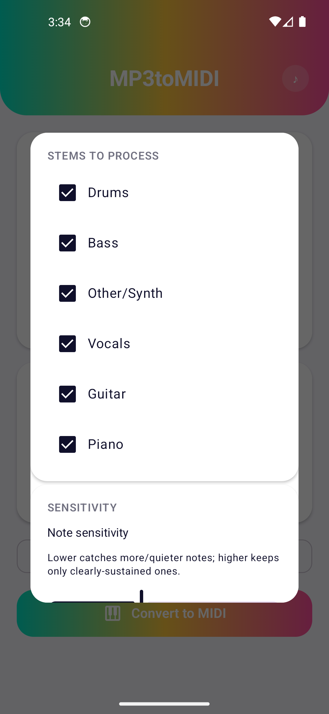
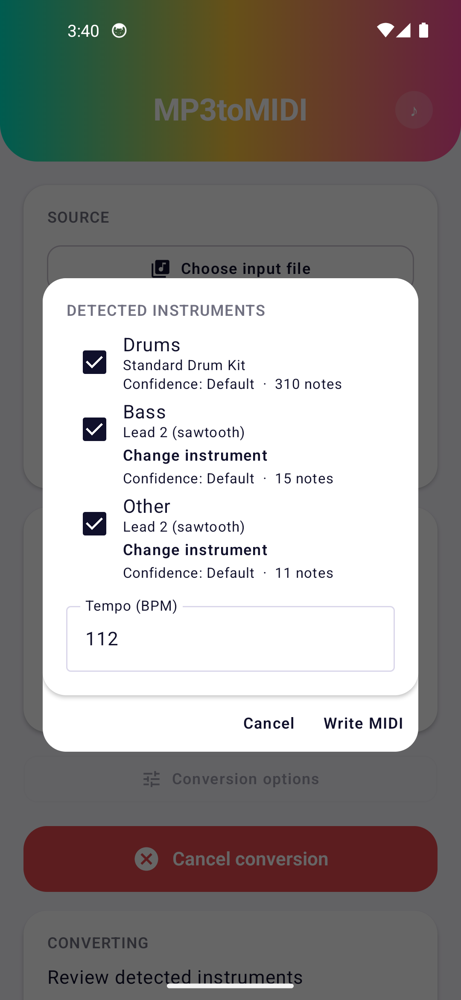

# MP3toMIDI

MP3toMIDI is a "proof of concept" idea I had where I wondered whether I could automate splitting stems from a real song and turning that into a decent MIDI file.
So far the results are.. interesting, but nowhere near good. The files tend to be too busy to be enjoyable but the original song is usually recognizable.

The way it works now is the song is split into 6 stems using Demucs and then those stems are shoved through a pitch transcriptor/drum hit identifier - this is then fed into a MIDI parser and a baby is made!

This baby runs locally on your device (Android 8.1+) after downloading a few models and a stock soundfont. Conversions take many minutes (10+) on a midrange device and could be more on something worse. 
You can use it as is if you like but you have been warned. 
(Under Construction GIF here)

Cheers

   

## Features

- Splits a song into 6 stems (drums, bass, vocals, guitar, piano and other) with Demucs'
  `htdemucs_6s`, the best sounding version of it, running right on your phone.
- Finds the notes in every pitched stem with Spotify's Basic Pitch, so chords come through
  instead of just one note at a time.
- Works out the drums hit by hit (kick, snare, closed hi-hat, crash/open hi-hat). Quiet hi-hats
  still get picked up under loud kicks, and it was tuned on real songs from a bunch of genres,
  not just test tones.
- Finds the tempo from the drums, and doesn't get fooled into half or double time by breakbeats
  and half-time grooves.
- Guesses the instrument for each stem with Google's YAMNet and picks the closest General MIDI
  sound. If YAMNet can't tell (synths mostly), it goes by the shape of the notes (bass, pad, lead
  or pluck), and if that fails too, it uses a default for the stem.
- Takes MP3, WAV, FLAC, AAC, OGG, Opus or anything else Android can play, and gives you a
  standard MIDI file back.
- Before converting you can pick which stems to use, how sensitive the note detection is, how
  quiet a stem can be before it's thrown out, and how you want the output: one file on one track,
  one file with a track per instrument, or a separate file for each stem.
- Once it's done listening, you get to check what it found before anything is written. Each stem
  shows its instrument, how sure it was and how many notes it found, and you can drop a stem,
  pick a different instrument or fix the tempo.
- Conversions keep going in the background, even if Android kills the app. Open it again and it
  picks up where the conversion is. There's a cancel button too, which cleans up after itself.
- A MIDI player with real soundfont playback, so you can hear what you got. It plays any `.mid`
  file, not just ones from this app, with the default soundfont or your own `.sf2`.
- Works offline after the first conversion. Demucs and YAMNet download once, get checked, and
  stay on the phone. Basic Pitch is small enough to come with the app.

## Installing

The easiest way to install MP3toMIDI and keep it up to date is through my F-Droid repo, which has
my other apps too. With the [F-Droid](https://f-droid.org/) app installed, open this link on
your phone to add the repo, or scan the QR code on the [repo page](https://roge-rm.gitlab.io/repo/):

[https://roge-rm.gitlab.io/repo](https://roge-rm.gitlab.io/repo?fingerprint=80438B253C257BCCE05CDCB9E3AC9B6174C2250659962B14FCBE7F32FD42D53E)

Then search for MP3toMIDI in F-Droid. When a new version comes out, F-Droid will offer it as an update.

You can also download the APK from the [Releases](https://github.com/roge-rm/MP3toMIDI/releases)
page and sideload it. Both are signed with the same key, so you can switch between them without
reinstalling.

## Requirements

- Android Studio (recent stable), with the NDK and CMake 4.1.2 for the audio engine. It'll offer
  to install them if they're missing.
- If you build from the command line, point `JAVA_HOME` at Android Studio's JDK:
  ```
  export JAVA_HOME=/path/to/android-studio/jbr
  ```
- minSdk 27 / targetSdk 37.
- A phone or emulator with a few GB of free RAM. Splitting the stems peaks around 750MB, it's
  a real neural network after all.
- Internet the first time you convert, for Demucs (~235MB) and YAMNet (~16MB), and the first time
  you open the player, for the default soundfont (~148MB). Not needed after that.

## Building & testing

```
./gradlew assembleDebug        # build the debug APK
./gradlew testDebugUnitTest    # run the unit tests
```

Release builds aren't signed unless you give it a keystore. Put your details in
`local.properties` (it never gets committed):

```
mp3tomidi.release.storeFile=/path/to/your.keystore
mp3tomidi.release.storePassword=...
mp3tomidi.release.keyAlias=...
mp3tomidi.release.keyPassword=...
```

then run `./gradlew assembleRelease`.

## Architecture

- `convert/` - `ConversionPipeline` runs the split, find notes and pick instruments steps
  based on `ConversionOptions`. It runs as two `WorkManager` jobs: `AnalysisWorker` does the
  listening and saves what it found to disk (`IntermediateResultStore`), `ReviewDialog` shows
  it to you, and once you confirm (`ReviewSelections`) `WriteWorker` loads it back, applies your
  changes and writes the MIDI. Splitting it in two is what makes the review step possible, and
  what lets a conversion survive the app being killed.
- `convert/stages/` - the steps themselves, each one swappable:
  - `DemucsStemSeparator` - runs `htdemucs_6s` over the song in overlapping chunks, blends them
    back together, and writes the stems to disk as it goes instead of holding them all in memory.
  - `BasicPitchTranscriber` / `CompositeNoteTranscriber` - finds the notes in pitched stems.
  - `DrumOnsetDetector` + `DrumHitClassifier` - finds the drum hits and works out what each one is.
  - `TempoDetector` - the tempo, from the drum hits.
  - `TimbreClassifier` (YAMNet), then `NoteEnvelopeClassifier`, then `DemucsSourceClassifier` -
    the three tries at picking an instrument for each stem, in order.
- `midi/` - `MidiFileWriter` writes standard MIDI files from scratch (format 0 for one track,
  format 1 for a track per instrument), and `MidiFileParser` reads them back for the player.
- `player/` - `Mp3Player` previews the source song, `MidiPlayer` plays a MIDI file through
  `SoundEngine` (instrument changes, seeking, pause).
- `audio/` + `cpp/` - `SoundEngine`/`NativeSoundEngine` on the Kotlin side, and an Oboe +
  TinySoundFont engine (`native_sound_engine.cpp`) on the native side, borrowed from
  [ScaleInKey](https://github.com/roge-rm/ScaleInKey). Notes get passed through a lock-free
  queue so Kotlin never gets in the way of the audio thread.
- `util/` - `AudioDecoder` (turns any song Android can play into raw audio), `ModelProvider`
  (downloads and checks the models and the soundfont), `PcmUtils`.
- `ui/` - the Compose screens (`MainScreen`, `PlayScreen`, `MainViewModel`), the options and
  review dialogs, and the theme. The button in the header (`AppHeader`) switches between
  converting and playing.
- `tools/` - Python scripts (not part of the app) that export each model to ONNX and check it
  against the original. Each folder has its own README with the details.

## Attribution

This app wouldn't exist without these:

- **[Demucs](https://github.com/facebookresearch/demucs)** (`htdemucs_6s`) by Meta/Facebook
  Research, MIT License. Exported to ONNX to run on the phone, see
  `tools/demucs_export/README.md`.
- **[Basic Pitch](https://github.com/spotify/basic-pitch)** by Spotify, Apache License 2.0.
  Comes with the app (it's only ~230KB), see `tools/basic_pitch_export/README.md`.
- **[YAMNet](https://tfhub.dev/google/yamnet/1)** by Google, Apache License 2.0, using the
  [AudioSet](https://research.google.com/audioset/) categories. The ONNX version is from
  `zeropointnine/yamnet-onnx` on Hugging Face, checked against the original, see
  `tools/yamnet_export/README.md`.
- **[ONNX Runtime Mobile](https://onnxruntime.ai/)** by Microsoft, MIT License. Runs all three
  models.
- **[FluidR3 GM](https://member.keymusician.com/Member/FluidR3_GM/)** soundfont by Frank Wen, MIT
  License. The player's default soundfont, downloaded the first time you use it.
- **[TinySoundFont](https://github.com/schellingb/TinySoundFont)** by Bernhard Schelling, MIT
  License. Included in `app/src/main/cpp/tsf.h`.
- **[Oboe](https://github.com/google/oboe)** by Google, Apache License 2.0. Low-latency audio for
  the player.
- Jetpack Compose, WorkManager, Media3 and the rest of AndroidX and Kotlin.

## License

MIT, see [LICENSE](LICENSE).
