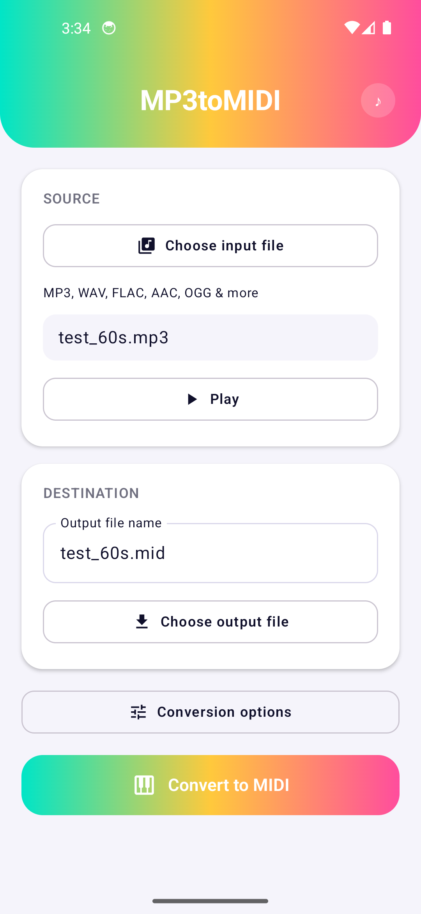
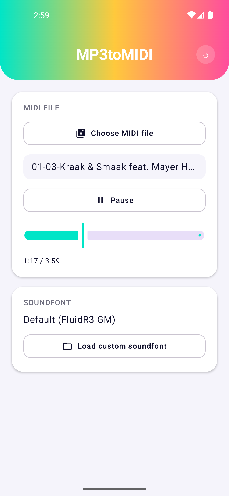

# MP3toMIDI

MP3toMIDI is a "proof of concept" idea I had where I wondered whether I could automate splitting stems from a real song and turning that into a decent MIDI file.
So far the results are.. interesting, but nowhere near good. The files tend to be too busy to be enjoyable but the original song is usually recognizable.

The way it works now is the song is split into 6 stems using Demucs and then those stems are shoved through a pitch transcriptor/drum hit idenitifier - this is then fed into a MIDI parser and a baby is made!

This baby runs locally on your device (Android 8.1+) after downloading a few models and a stock soundfont. Conversions take many minutes (10+) on a midrange device and could be more on something worse. 
You can use it as is if you like but you have been warned. 
(Under Construction GIF here)

Cheers

 

## Features

- **6-stem separation** (drums, bass, vocals, guitar, piano, other) via `htdemucs_6s`, the
  highest-quality Demucs configuration, run fully on-device through ONNX Runtime Mobile.
- **Polyphonic pitch transcription** for every pitched stem via Spotify's Basic Pitch
  (onset/pitch/offset detection), instead of a single monophonic pitch track for the whole song.
- **Real drum-hit classification** (kick, snare, closed hi-hat, crash/open hi-hat) from the
  isolated drums stem — dual-band onset detection (so quiet hi-hats aren't drowned out by loud
  kicks) plus FFT band-power and decay-shape heuristics, calibrated against real songs across
  several genres rather than only synthetic test signals.
- **Real tempo detection** via autocorrelation of the drum onset envelope, with a correction for
  the specific case where a syncopated backbeat pattern (breakbeats, half-time grooves) fools a
  naive autocorrelation into locking onto the wrong metrical level.
- **Real instrument classification per stem**, not a fixed guess — Google's YAMNet identifies
  what a stem actually sounds like and maps it to the closest General MIDI program, with a
  note-envelope-shape fallback (bass / pad / lead / pluck) for synthesizer timbres that a
  real-instrument-trained classifier can't confidently place, and a fixed per-stem default as the
  last resort.
- **Broad format support in** — MP3, WAV, FLAC, AAC, OGG, Opus, or anything else Android's own
  media decoders handle — and a **Standard MIDI File (Type 0) out**.
- **Fully offline after first use.** The two large models (Demucs, YAMNet) download once,
  verified by SHA-256, and are cached in app-private storage; only Basic Pitch's much smaller
  export ships bundled in the APK. Every conversion after the first needs no network at all.
- Conversion runs as a foreground `WorkManager` job so it survives the app being backgrounded,
  with a **cancel button** (with confirmation) that stops the job and cleans up its temp files.
- **In-app MIDI playback** with real soundfont (SF2) synthesis — load any `.mid` file (not just
  ones this app produced) and hear it through a bundled-quality default soundfont, or load your
  own GM-compatible `.sf2`. Lets you A/B a conversion's output by ear, not just as data.

## Requirements

- Android Studio (recent stable).
- A JDK — this project has no system-wide `JAVA_HOME` requirement baked in, but if you're running
  Gradle from the command line rather than through Android Studio, point `JAVA_HOME` at Android
  Studio's bundled JBR, e.g.:
  ```
  export JAVA_HOME=/path/to/android-studio/jbr
  ```
- minSdk 27 / targetSdk 37.
- A device or emulator with a few GB of free RAM for the separation stage — the ONNX Runtime
  session settings are tuned to keep peak memory around ~750MB, but it's still real on-device
  neural network inference, not a lightweight operation.
- An internet connection the *first* time you run a conversion, to download the Demucs (~235MB)
  and YAMNet (~16MB) models. Not needed again after that. The MIDI playback screen has its own
  first-use download too: the default soundfont (~148MB).
- The NDK and CMake (4.1.2), for the native audio engine behind MIDI playback — Android Studio
  will prompt to install these if missing.

## Building & testing

```
./gradlew assembleDebug        # build the debug APK
./gradlew testDebugUnitTest    # run the unit tests
```

Release builds are unsigned by default. To produce a signed release APK, add your own keystore
credentials to `local.properties` (never committed):

```
mp3tomidi.release.storeFile=/path/to/your.keystore
mp3tomidi.release.storePassword=...
mp3tomidi.release.keyAlias=...
mp3tomidi.release.keyPassword=...
```

then `./gradlew assembleRelease`.

## Architecture

- `convert/` — `ConversionPipeline` orchestrates the separate → transcribe → classify → write
  stages; `ConversionWorker` runs it as a `WorkManager` `CoroutineWorker`/foreground service so a
  conversion can outlive the app being backgrounded (and so it can be cancelled cleanly).
- `convert/stages/` — the pipeline stages themselves, each independently swappable:
  - `DemucsStemSeparator` — runs the ONNX-exported `htdemucs_6s` model in overlapping windows,
    cross-faded back together, streaming output to disk rather than holding the whole song in
    memory across all 6 stems at once.
  - `BasicPitchTranscriber` / `CompositeNoteTranscriber` — polyphonic note transcription for
    pitched stems.
  - `DrumOnsetDetector` + `DrumHitClassifier` — onset detection and per-hit percussion
    classification for the drums stem.
  - `TempoDetector` — global BPM estimate from the drum onset envelope.
  - `TimbreClassifier` (YAMNet) + `NoteEnvelopeClassifier` + `DemucsSourceClassifier` — the
    three-tier fallback chain that picks a GM program for each stem.
- `midi/` — `MidiFileWriter`, a from-scratch Standard MIDI File (Type 0) writer, and
  `MidiFileParser`, which reads one back (general format 0/1, multiple tempo changes) into a
  flat, time-sorted event list for playback.
- `player/` — `Mp3Player` (source-audio preview) and `MidiPlayer` (sequences a parsed MIDI file
  against `SoundEngine` in real time: per-channel program state, seeking, pause).
- `audio/` + `cpp/` — `SoundEngine`/`NativeSoundEngine` (Kotlin) and a native Oboe + TinySoundFont
  engine (`native_sound_engine.cpp`, ported from the sibling
  [ScaleInKey](https://github.com/roge-rm/ScaleInKey) project) for real-time SF2 synthesis, with a
  lock-free command queue so note-on/off requests from Kotlin never race with rendering on the
  audio callback thread.
- `util/` — `AudioDecoder` (generic `MediaExtractor`/`MediaCodec` decoding to PCM),
  `ModelProvider` (checksum-verified on-demand downloads, used for the Demucs/YAMNet models and
  the default soundfont alike), `PcmUtils`.
- `ui/` — Jetpack Compose screens (`MainScreen`, `PlayScreen`, `MainViewModel`) and the app's
  theme. A header toggle (see `AppScreen`/`AppHeader`) switches between the two screens.
- `tools/` — standalone Python scripts (not part of the Android build) that export and verify
  each ONNX model against its real upstream implementation; see each subfolder's own README for
  exactly how and why.

## Attribution

This app wouldn't exist without the following open-source models and libraries:

- **[Demucs](https://github.com/facebookresearch/demucs)** (`htdemucs_6s`) — Meta/Facebook
  Research, MIT License. Exported to ONNX for on-device inference; see
  `tools/demucs_export/README.md` for the conversion process.
- **[Basic Pitch](https://github.com/spotify/basic-pitch)** — Spotify, Apache License 2.0.
  Bundled directly in the app (its ONNX export is only ~230KB); see
  `tools/basic_pitch_export/README.md`.
- **[YAMNet](https://tfhub.dev/google/yamnet/1)** — Google, Apache License 2.0, via the
  [AudioSet](https://research.google.com/audioset/) ontology. ONNX conversion sourced from
  `zeropointnine/yamnet-onnx` on Hugging Face and verified against the real TF-Hub model; see
  `tools/yamnet_export/README.md`.
- **[ONNX Runtime Mobile](https://onnxruntime.ai/)** — Microsoft, MIT License. Runs all three
  models on-device.
- **[FluidR3 GM](https://member.keymusician.com/Member/FluidR3_GM/)** soundfont — Frank Wen, MIT
  License. The default soundfont for in-app MIDI playback; downloaded on first use (see
  `SoundEngine.kt`).
- **[TinySoundFont](https://github.com/schellingb/TinySoundFont)** — Bernhard Schelling, MIT
  License. Vendored directly (`app/src/main/cpp/tsf.h`) for real-time SF2 synthesis.
- **[Oboe](https://github.com/google/oboe)** — Google, Apache License 2.0. Low-latency native
  audio output for MIDI playback.
- Jetpack Compose, WorkManager, Media3, and the rest of the AndroidX/Kotlin ecosystem.

## License

MIT — see [LICENSE](LICENSE).
